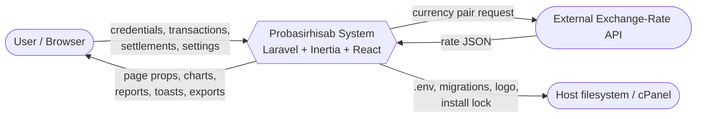
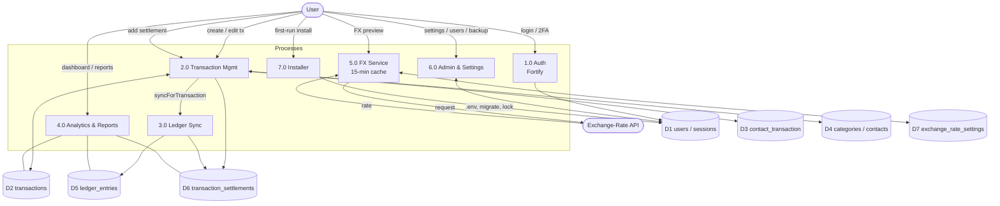
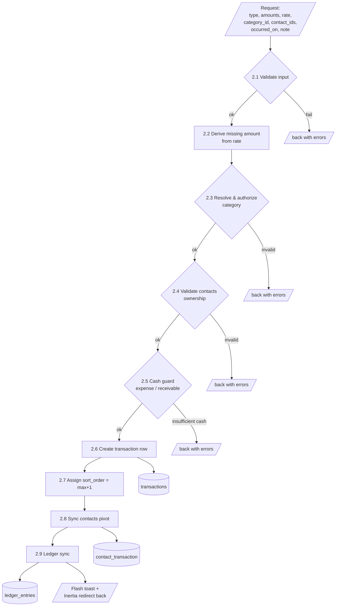

# Probasirhisab — Data Flow Diagrams (DFD)

Three levels of decomposition: context (Level 0), major processes (Level 1), and a
Level 2 explosion of the "Create Transaction" process. Mermaid flow sources are mirrored
under [`diagrams/`](diagrams/).

---

## Level 0 — Context Diagram

The system has two runtime external entities (the **User** browser and the **Exchange-Rate
API**) plus the **host filesystem** touched during installation.



---

## Level 1 — Major Processes & Data Stores



**Data stores**

| ID | Store | Written by | Read by |
|----|-------|-----------|---------|
| D1 | users / sessions | Auth, Installer, Admin | all authenticated flows |
| D2 | transactions | Transaction Mgmt | Ledger Sync, Analytics |
| D3 | contact_transaction | Transaction Mgmt | Transaction/Contact views |
| D4 | categories / contacts | Category/Contact Mgmt | Transaction Mgmt |
| D5 | ledger_entries | Ledger Sync | Ledger view, cash balance |
| D6 | transaction_settlements | Settlement Mgmt | Ledger Sync, Analytics |
| D7 | exchange_rate_settings | Currency settings | FX Service |

---

## Level 2 — Process 2.0 "Create Transaction"



**Guard rules applied in 2.5**

- `expense` and `receivable` require `PrimaryCashBalance ≥ amount` (else validation error).
- On update, the previous outflow is credited back before re-checking available cash.

---

## Level 2 — Process 3.0 "Ledger Sync" (`TransactionLedgerSync`)

```mermaid
flowchart TB
    In[/syncForTransaction(tx)/]
    Base[Upsert base line<br/>keyed on transaction_id, settlement_id=null]
    Rule{tx.type?}
    Cr[credit_primary = amount]
    Db[debit_primary = amount]
    IsObl{payable or<br/>receivable?}
    Del[Delete stray settlement<br/>ledger lines]
    Loop[For each settlement:<br/>upsert line, derive secondary<br/>via ratio]
    Prune[Prune ledger lines for<br/>removed settlements]
    D5[(ledger_entries)]

    In --> Rule
    Rule -->|income / payable| Cr --> Base
    Rule -->|expense / receivable| Db --> Base
    Base --> IsObl
    IsObl -->|no| Del --> D5
    IsObl -->|yes| Prune --> Loop --> D5
```
