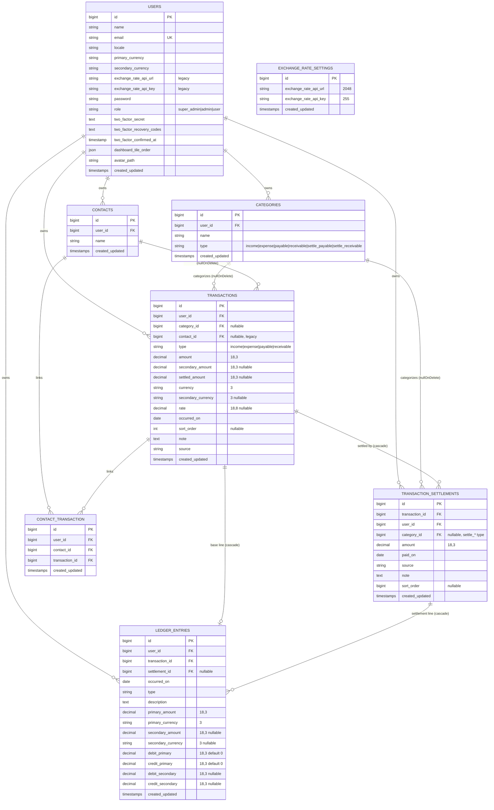

# Probasirhisab — Entity Relationship Diagram (ERD)

This document describes the relational schema as implemented in `database/migrations/`.
The Mermaid source is also available standalone at [`diagrams/erd.mmd`](diagrams/erd.mmd).

## Overview

The data model is **user-owned**: every domain row carries a `user_id` and cascades on
user deletion. The financial core is `transactions` → `transaction_settlements` →
`ledger_entries`, where the ledger is the derived source of truth for cash balance.

## Tables in detail

### `users`
Account holder and owner of all data. Notable columns beyond the Laravel default:
`role` (enum-backed string), `primary_currency`/`secondary_currency`, `locale`,
`dashboard_tile_order` (JSON), `avatar_path`, and Fortify 2FA columns. The legacy
`exchange_rate_api_url/key` columns are superseded by the global `exchange_rate_settings`
table and can be retired.

### `categories`
Per-user labels with a `type`. `UNIQUE(user_id, type, name)` prevents duplicates;
`INDEX(user_id, type)` supports the grouped-by-type reads used throughout the app.

### `contacts`
"People" the user transacts with. `INDEX(user_id, name)`.

### `transactions`
Central record. Dual currency via `amount`/`currency` (primary) and optional
`secondary_amount`/`secondary_currency`/`rate`. `settled_amount` is a **denormalized cache**
of the settlement sum (source of truth is `Σ transaction_settlements.amount`). `sort_order`
drives manual drag ordering. Indexes: `(user_id, type, occurred_on)`,
`(user_id, contact_id, occurred_on)`, `(user_id, sort_order, id)`,
`transactions_user_occurred_id_idx(user_id, occurred_on, id)`.

### `transaction_settlements`
Payments against a payable/receivable. `category_id` references a `settle_*` category.
Indexes: `(transaction_id, paid_on)`, `ts_user_paid_on_idx(user_id, paid_on)`,
`(user_id, sort_order)`.

### `ledger_entries`
Projected debit/credit lines maintained by `TransactionLedgerSync`. One base line per
transaction (`settlement_id = NULL`) plus one line per settlement.
`UNIQUE(transaction_id, settlement_id)` (relaxed from the original `UNIQUE(transaction_id)`
in migration `2026_05_01_000007`). `INDEX(user_id, occurred_on, id)`.

### `contact_transaction`
Many-to-many pivot between contacts and transactions.
`UNIQUE(contact_id, transaction_id)` + `(user_id, contact_id)` + `(user_id, transaction_id)`.

### `exchange_rate_settings`
Single global row (managed via `ExchangeRateSetting::the()`) holding the FX API URL/key
used for rate previews.

## Referential integrity

| Child | Parent | On delete |
|-------|--------|-----------|
| categories.user_id | users.id | cascade |
| contacts.user_id | users.id | cascade |
| transactions.user_id | users.id | cascade |
| transactions.category_id | categories.id | set null |
| transactions.contact_id (legacy) | contacts.id | set null |
| transaction_settlements.transaction_id | transactions.id | cascade |
| transaction_settlements.user_id | users.id | cascade |
| transaction_settlements.category_id | categories.id | set null |
| ledger_entries.user_id | users.id | cascade |
| ledger_entries.transaction_id | transactions.id | cascade |
| ledger_entries.settlement_id | transaction_settlements.id | cascade |
| contact_transaction.* | users/contacts/transactions | cascade |

In addition to DB cascades, `Transaction::booted()` deletes dependent `ledger_entries` on
model deletion, and `User::booted()` removes the avatar file from storage.

## System / framework tables

`password_reset_tokens`, `sessions`, `cache`, `cache_locks`, `jobs`, `job_batches`,
`failed_jobs` — created by the default Laravel migrations for auth, cache, and queue infra.
